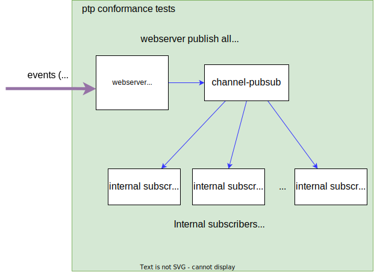

# ptp-events-listener

## Overview
The ptp-event-listener enables to directly stream events from the ptp-operator linux-ptp-daemon pods.
This project does the following:
- get the outbound IP of the local host. This is achieved by pinging the k8s api of the cluster running the ptp-operator.
- create a port forwarding tunnel between the local host and the linux-ptp-daemon pod running the cloud-event-proxy container. The tunnel creates a localhost:4093 endpoint to enable direct access between the local host and the linux-ptp-daemon pod.
- create a http server to receive any http request/responses in the local host. The server listen to 0.0.0.0:8989. This is used to complete registration steps and receive events
- send a registration request to the tunnel endpoint at localhost:4093 to register a new subscriber to the cloud-event-proxy. The registration message contains:
    - the address and port of the http server that is registering the events. This is the <outbound IP>:8989.
    - the events it is interested in
- After successful registration, ptp events are streamed via POST messages to the registered <outbound IP>:8989 endpoint
- the local host HTTP server receives the POST messages and dispatches them to internal subscribers

## Dispatch of events to internal subscribers 

Internal dispatch of ptp events is done via the channel-pubsub project, using native Golang channels:
- the webserver publishes all events received via POST messages to the channel-pubsub object. Currently only event.sync.sync-status.os-clock-sync-state-change are supported.
- any internal process can register to receive a certain event (today only event.sync.sync-status.os-clock-sync-state-change is available)
- any time a event is received by the HTTP server all internal processes that have registered it are notified.

## Example
An example project is at https://github.com/test-network-function/ptp-listener-example